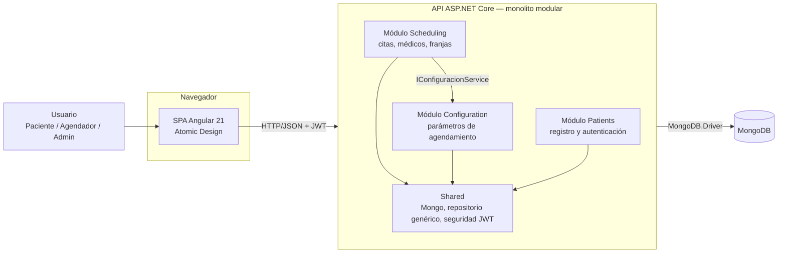

# Citas Médicas — Piedrazul

Aplicación web para la reserva autónoma de citas médicas y de terapia del centro Piedrazul. Los pacientes agendan su cita en línea, los agendadores consultan la agenda de cada profesional y el administrador define la disponibilidad y la configuración de atención de cada médico o terapista.

Proyecto del curso Ingeniería de Software III — Universidad del Cauca, Facultad de Ingeniería Electrónica y Telecomunicaciones, Programa de Ingeniería de Sistemas (2026-2).

---

## Contenido

1. [Descripción general](#1-descripción-general)
2. [Tecnologías](#2-tecnologías)
3. [Arquitectura](#3-arquitectura)
4. [Estructura del repositorio](#4-estructura-del-repositorio)
5. [Cómo ejecutar el proyecto](#5-cómo-ejecutar-el-proyecto)
6. [API REST](#6-api-rest)
7. [Release 1 — Primer corte](#7-release-1--primer-corte)


---

## 1. Descripción general

### ¿Qué problema resuelve?

Hoy las citas se coordinan en gran parte por WhatsApp y llamadas manuales. Ese flujo es lento, depende de la disponibilidad de una persona para responder y no ofrece una vista clara de la agenda. Esta aplicación centraliza el proceso para que el paciente pueda reservar de forma autónoma y el personal pueda consultar la agenda de manera más ordenada.

- El paciente se registra, inicia sesión, revisa la disponibilidad real y agenda su cita en pocos pasos.
- El agendador consulta las citas de un médico o terapista en una fecha determinada.
- El administrador configura la disponibilidad de cada profesional: días de atención, franja horaria, intervalo entre citas y cuántas semanas hacia adelante se habilita la agenda.

Las franjas que ve el paciente se calculan automáticamente según la configuración del profesional y las citas ya reservadas.

### Roles

| Rol | Qué puede hacer | Pantalla de inicio |
|---|---|---|
| Paciente | Registrarse, iniciar sesión, agendar citas y ver sus citas | /agendar |
| Agendador | Listar las citas de un médico o terapista por fecha | /citas |
| Administrador | Configurar la disponibilidad de cada profesional y consultar el listado de citas | /admin/configuracion |

### Pantallas

| Ruta | Descripción | Acceso |
|---|---|---|
| /login | Inicio de sesión | Público |
| /registro | Registro de paciente | Público |
| /agendar | Elegir médico, fecha y franja; confirmar la cita | Paciente |
| /mis-citas | Historial de citas del paciente | Paciente |
| /citas | Listado de citas por médico y fecha | Agendador, Administrador |
| /admin/configuracion | Parámetros de agendamiento por médico | Administrador |

---

## 2. Tecnologías

| Capa | Tecnología |
|---|---|
| Frontend | Angular 21, TypeScript, SCSS |
| Diseño de UI | Atomic Design (atoms → molecules → organisms → templates → pages) |
| Backend | ASP.NET Core (.NET 10) con API REST |
| Persistencia | MongoDB con MongoDB.Driver |
| Seguridad | JWT Bearer, BCrypt para contraseñas y autorización por roles |
| Infraestructura local | Docker Compose para MongoDB y Mongo Express |

---

## 3. Arquitectura

El backend se implementa como un monolito modular: un único despliegue, pero dividido en módulos con límites claros. Cada módulo tiene sus capas Domain, Application, Infrastructure y Api, y se registra desde un punto de entrada común en Program.cs. Esto permite mantener una separación de responsabilidades sin introducir un sistema distribuido pesado para un proyecto de este alcance.

Los módulos no se acceden entre sí mediante sus repositorios directamente, sino a través de interfaces públicas de la capa Application. Por ejemplo, Scheduling consulta la disponibilidad o configuración de un profesional a través de IConfiguracionService.



### Patrones y principios aplicados

| Patrón / principio | Dónde | Para qué |
|---|---|---|
| Repository | Shared/Infrastructure/MongoRepository<T> y repositorios por entidad | Aislar el dominio del detalle de persistencia |
| Strategy | IGeneradorFranjasStrategy / FranjasFijasStrategy | Cambiar el algoritmo de cálculo de franjas sin tocar la lógica principal |
| Inyección de dependencias | Servicios del backend | Reducir acoplamiento y mejorar la prueba automática |
| Módulos de aplicación | SchedulingModule, ConfigurationModule, PatientsModule | Encapsular el registro y las responsabilidades de cada área |
| Options Pattern | MongoDbSettings, JwtSettings | Configuración tipada e inyectable |
| DTO | Application/Dtos | Separar el contrato de API de los modelos de persistencia |
| Interceptor | authInterceptor en Angular | Adjuntar el token JWT a las peticiones sin repetir lógica |
| Atomic Design | frontend/src/app/shared | Componentes reutilizables con una sola responsabilidad |

---

## 4. Estructura del repositorio

```text
.
├── backend/
│   └── CitasMedicas.Api/
│       ├── Modules/
│       │   ├── Scheduling/        # citas, médicos y generación de franjas
│       │   ├── Configuration/     # configuración del agendamiento
│       │   └── Patients/          # registro, autenticación y roles
│       ├── Shared/
│       │   ├── Infrastructure/    # Mongo, repositorio base y convenios
│       │   └── Security/          # JWT y definición de roles
│       ├── Program.cs             # composición de dependencias
│       └── ...
├── frontend/
│   └── src/app/
│       ├── core/                 # modelos, servicios y autenticación
│       ├── pages/                # pantallas por caso de uso
│       └── shared/               # atoms, molecules, organisms, templates
├── mongo-init/                   # script de limpieza y carga de datos de prueba
├── docker-compose.yml            # MongoDB local y Mongo Express
├── CitasMedicas.slnx             # solución del proyecto
├── README.md                     # documentación principal
└── .gitignore
```

---

## 5. Cómo ejecutar el proyecto

### Requisitos

- .NET SDK 10
- Node.js LTS y npm
- MongoDB local con Docker o una instancia remota de MongoDB Atlas

### 1) Base de datos

#### Opción A: MongoDB local con Docker

```bash
docker compose up -d
```

Esto levanta MongoDB en localhost:27017 y Mongo Express en http://localhost:8081. Para cargar los datos de prueba:

```bash
docker exec -i piedrazul-mongo mongosh --quiet < mongo-init/reset-and-seed.js
```

> Este script borra y recrea las colecciones principales del sistema; úsalo solo en desarrollo.

#### Opción B: MongoDB Atlas

Crea un clúster, un usuario de base de datos y copia la cadena de conexión. Luego ejecuta el script de inicialización contra esa base para cargar los datos de prueba.

### 2) Backend

Los secretos no se guardan en el repositorio; cada entorno define sus valores con user-secrets.

```bash
cd backend/CitasMedicas.Api

dotnet user-secrets set "MongoDbSettings:ConnectionString" "mongodb://localhost:27017"
dotnet user-secrets set "JwtSettings:Key" "<clave-generada>"

dotnet run --launch-profile http
```

Para generar una clave aleatoria:

```bash
# Linux / macOS / Git Bash
openssl rand -base64 48
```

```powershell
# Windows PowerShell
[Convert]::ToBase64String((1..48 | ForEach-Object { Get-Random -Maximum 256 }) -as [byte[]])
```

La API queda en http://localhost:5039. La documentación OpenAPI se expose en http://localhost:5039/openapi/v1.json.

### 3) Frontend

```bash
cd frontend
npm install
npm start
```

La aplicación queda en http://localhost:4200. La URL de la API se configura en frontend/src/environments/environment.ts.

### 4) Usuarios de prueba

Se cargan por medio del script de seed:

| Rol | Correo | Contraseña |
|---|---|---|
| Paciente | paciente@example.com | Paciente123 |
| Agendador | agendador@example.com | Agendador123 |
| Administrador | admin@example.com | Admin123 |

También se crean médicos de ejemplo con su configuración inicial para que la agenda pueda calcular franjas disponibles.

### 5) Pruebas

```bash
# Frontend
cd frontend && npm test

# Backend
dotnet test
```

Estado verificado del backend: la suite de pruebas automatizadas de xUnit está instalada y ejecuta correctamente una batería de pruebas de servicios clave.

---

## 6. API REST

Todas las rutas cuelgan de /api. Salvo las rutas públicas, requieren el encabezado Authorization: Bearer <token>.

| Método | Ruta | Acceso | Descripción |
|---|---|---|---|
| POST | /auth/login | Público | Inicio de sesión y emisión del JWT |
| POST | /pacientes/registro | Público | Registro de un paciente |
| GET | /pacientes/{id} | Autenticado | Consulta de datos del paciente |
| GET | /medicos | Autenticado | Lista de médicos y terapistas |
| GET | /citas?medicoId=&fecha= | Agendador, Administrador | Listado de citas por médico y fecha |
| GET | /citas/franjas-disponibles?medicoId=&fecha= | Autenticado | Cálculo de franjas disponibles |
| POST | /citas/agendar | Paciente | Registro de una cita |
| GET | /citas/mis-citas | Paciente | Citas del paciente autenticado |
| GET | /configuracion/{medicoId} | Administrador | Consulta de configuración |
| PUT | /configuracion | Administrador | Creación o actualización de configuración |

Códigos de respuesta habituales: 200/201 para éxito, 400 para datos inválidos, 401 para sesión ausente o token vencido, 403 para permisos insuficientes, 404 para recursos no encontrados y 409 para reglas de negocio incumplidas.

---

## 7. Release 1 — Primer corte

Primera entrega del proyecto de curso. Incluye los tres requisitos funcionales de alto valor definidos en este corte, junto con la autenticación necesaria para que el agendamiento sea seguro.

### 7.1 Alcance

| Requisito | Descripción | Estado |
|---|---|---|
| RF1 | Listar las citas de un médico o terapista en una fecha | Implementado |
| RF2 | Registro de paciente y agendamiento por web con franja disponible | Implementado |
| RF3 | Configuración del administrador para disponibilidad por profesional | Implementado |
| Soporte | Inicio de sesión con JWT y control de acceso por rol | Implementado |
| Extra | Pantalla Mis citas para el paciente | Implementado |

### 7.2 Historias de usuario y criterios de aceptación

**HU-01 · Listar citas por médico y fecha (RF1)**
Como agendador de citas, quiero listar las citas de un profesional en una fecha determinada para ver el estado de la agenda.

- Dado que inicié sesión como Agendador o Administrador, cuando selecciono un médico y una fecha, entonces veo una tabla con los datos de cada cita.
- Dado que hay resultados, entonces las citas aparecen ordenadas por hora.
- Dado que no hay citas, entonces el sistema lo indica con un mensaje claro.
- Dado que soy Paciente, cuando intento acceder a esta vista, entonces el sistema me lo niega.

**HU-02 · Registro e inicio de sesión del paciente (RF2)**
Como paciente, quiero registrarme e iniciar sesión para poder agendar una cita de forma segura.

- Dado que completo el formulario con datos válidos, entonces se crea mi cuenta con rol Paciente.
- Dado que ya existe una cuenta con el mismo correo, entonces el sistema rechaza el registro con un mensaje claro.
- Dado que ingreso credenciales correctas, entonces inicio sesión y accedo al flujo de agendamiento.
- Dado que las credenciales son incorrectas, entonces el sistema responde con un error genérico.

**HU-03 · Agendar una cita (RF2)**
Como paciente, quiero agendar una cita desde la web viendo solo franjas disponibles.

- Dado que elegí un médico y una fecha, entonces el sistema muestra únicamente las franjas libres.
- Dado que una franja ya está ocupada, entonces no aparece como opción.
- Dado que la fecha excede la ventana permitida para ese profesional, entonces no se ofrecen franjas.
- Dado que confirmo la cita, entonces la cita queda registrada a mi nombre y aparece en Mis citas.

**HU-04 · Configurar la disponibilidad de los profesionales (RF3)**
Como administrador, quiero definir la disponibilidad del sistema para que el agendamiento se adapte a la agenda de cada profesional.

- Dado que soy Administrador, cuando selecciono un profesional, entonces veo su configuración actual.
- Dado que modifico días, horarios, intervalo y semanas habilitadas, cuando guardo, entonces la configuración queda almacenada.
- Dado que no soy Administrador, entonces no puedo consultar ni modificar la configuración.

### 7.3 Atributos de calidad prioritarios

#### Seguridad

| Elemento | Escenario |
|---|---|
| Contexto | Sistema con pacientes, agendadores y administrador |
| Estímulo | Un usuario sin el rol adecuado intenta acceder a una operación restringida |
| Respuesta | La API rechaza la solicitud con 401 o 403 validando el JWT y el rol |
| Medición | Se valida la autenticación y la autorización en el servidor; se evita guardar contraseñas en texto plano |
| Resultado esperado | Solo los roles autorizados acceden a cada operación |

#### Usabilidad

| Elemento | Escenario |
|---|---|
| Contexto | Un paciente quiere reservar una cita sin ayuda técnica |
| Estímulo | El paciente inicia sesión y elige médico, fecha y franja |
| Respuesta | El sistema guía la experiencia en pocos pasos y muestra solo horarios reales |
| Medición | La reserva se realiza con un flujo directo y claro |
| Resultado esperado | Agendar una cita es más simple y rápido que coordinarla por WhatsApp |

### 7.4 Diseño de software

- Modelo C4: los tres roles interactúan con la SPA; los contenedores son la SPA Angular, la API ASP.NET Core y la base MongoDB.
- Patrones de diseño: repository, strategy, inyección de dependencias y DTOs.
- Principios SOLID: responsabilidad única por servicio, dependencia de abstracciones y extensión del algoritmo de franjas sin modificar el servicio principal.

### 7.5 Pruebas

| Ámbito | Estado |
|---|---|
| Frontend | Pendiente: servicios, interceptor, guards y pruebas de UI |
| Backend — servicios clave | Verificado: pruebas unitarias de AuthService y CitaService en xUnit |
| Backend — estrategia de franjas | En revisión y ampliación |

Resultado actual verificado: 4 pruebas del backend ejecutándose correctamente con xUnit.


### 7.6 Próximos pasos

- Cancelación y reprogramación de citas.
- Notificaciones al paciente por correo o mensajería.
- Límite de intentos de inicio de sesión.
- Almacenar el JWT en cookie HttpOnly en lugar de localStorage.
- Integración y despliegue continuos.


**Convención de commits:** [Conventional Commits](https://www.conventionalcommits.org/es/v1.0.0/) (`feat`, `fix`, `docs`, `test`, `chore`), con alcance opcional por requisito, por ejemplo `feat(RF2): registro de paciente`.
